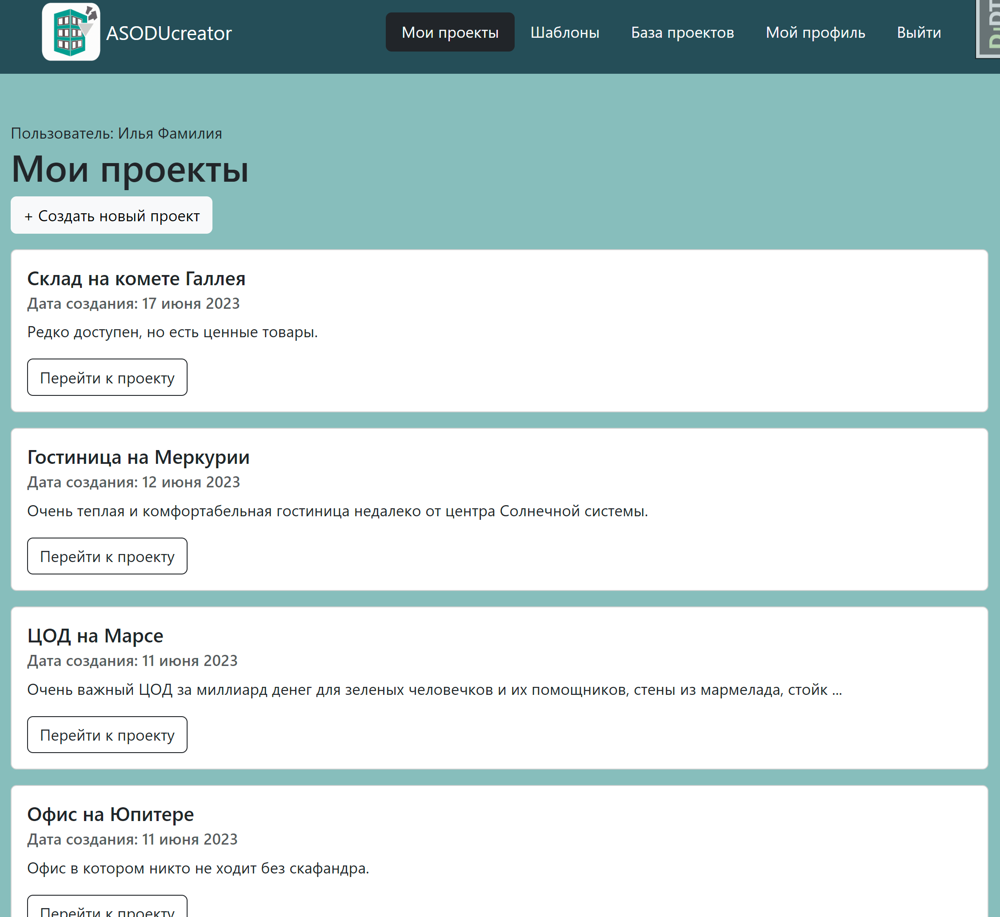
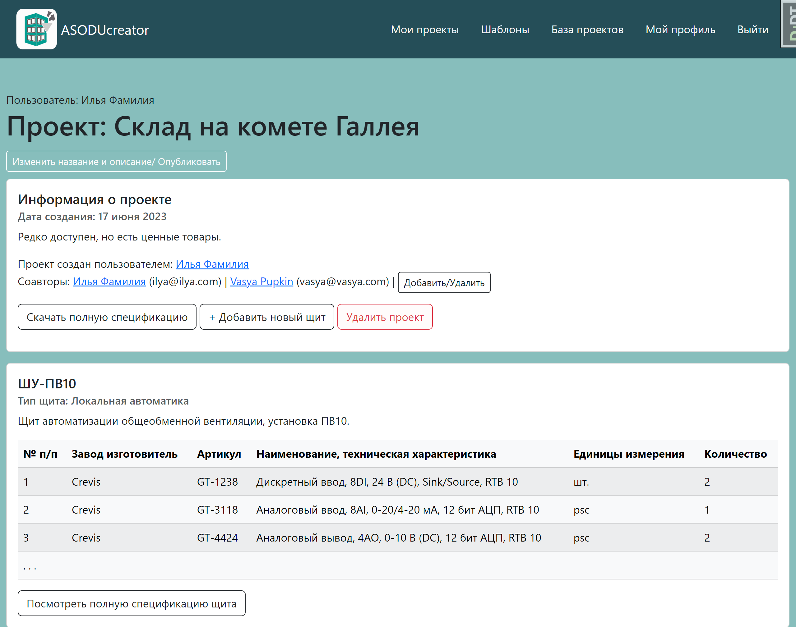
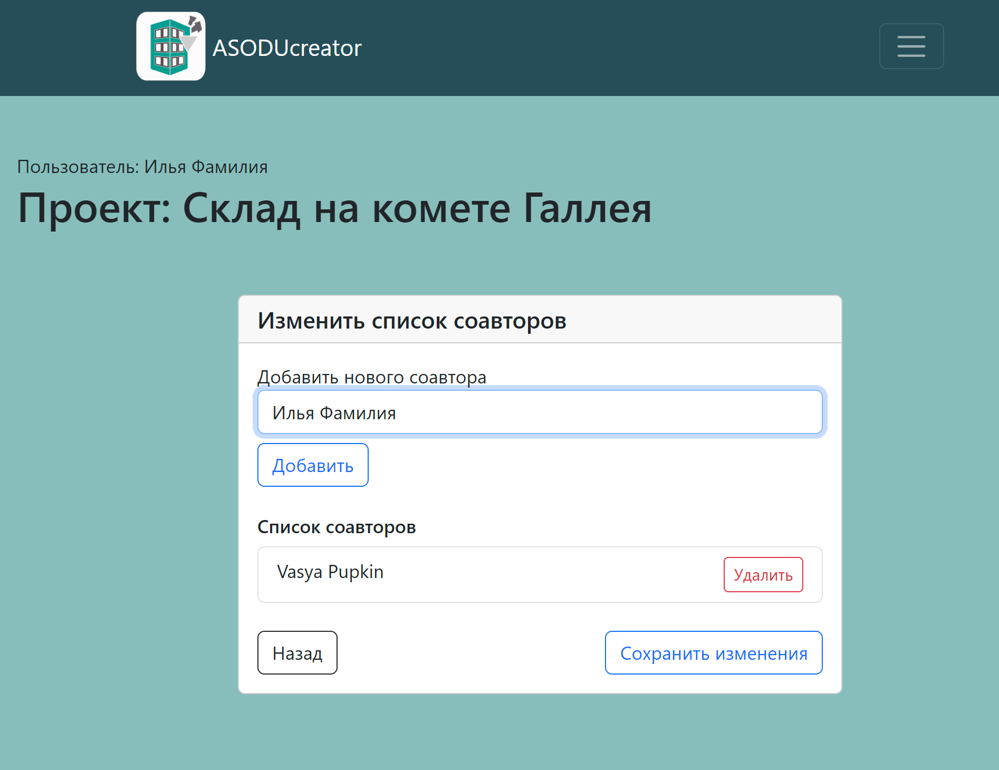
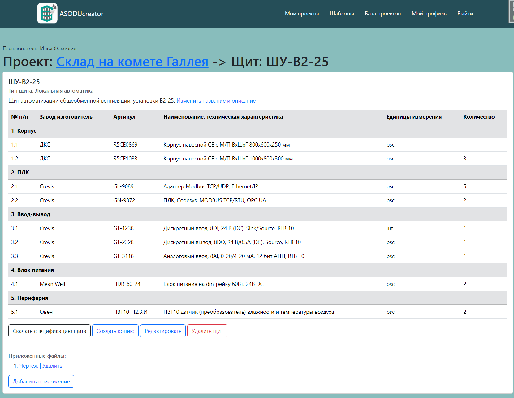
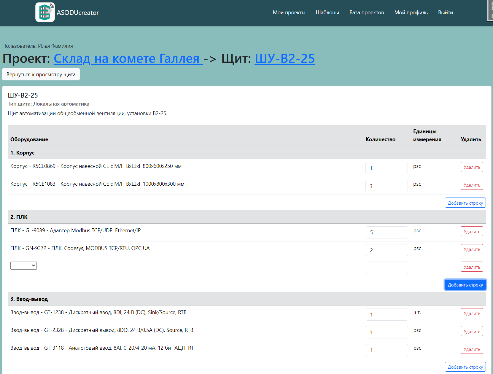
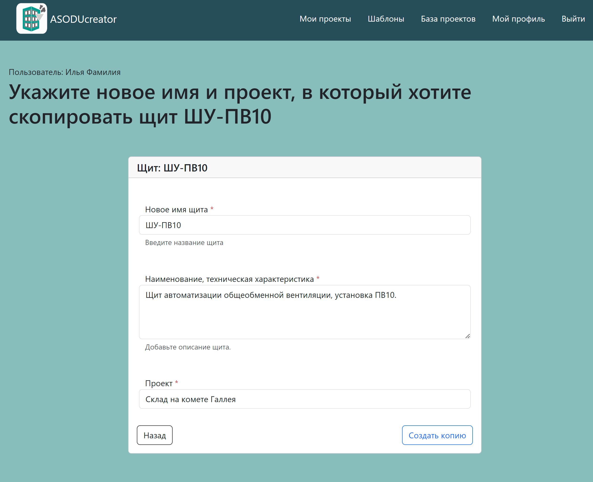

# ASODU_creator 🤖


**ASODU_creator** — это приложение для управления проектами автоматизации и создания спецификаций щитов, оборудования, всего проекта целиком и других связанных данных. Ведение проекта в приложении позволяет быстро копировать щиты между проектами для адаптации и переиспользования.

## Особенности

- Управление проектами и связанными щитами.
- Настройка оборудования через пользовательские формы.
- Выгрузка спецификаций по щитам и проектам в стандартном формате в Excell.
- Работа с вложениями и файлами.
- Разграничение доступа к проектам.
- Поддержка оптимизированных формсетов с динамическим добавлением/удалением строк.
- Оптимизация, использование `select_related` и `prefetch_related` для снижения количества SQL-запросов.
- Настраиваемые формы для гибкости отображения данных.

## Установка
<details>
<summary>Инструкция по локальному запуску</summary>

### 1. Клонирование репозитория

```bash
git clone https://github.com/botanikboy/ASODU_creator.git
cd ASODU_creator
```
### 2. Установка зависимостей
Убедитесь, что у вас установлен Python 3.9+ и виртуальное окружение. Для запуска базы данных также потребуется Docker.

```bash
python -m venv venv
source venv/bin/activate  # Для Linux/MacOS
venv\Scripts\activate     # Для Windows
pip install -r requirements.txt
```
### 3. Настройка базы данных
Создате `.env` файл, указав параметры подключения к вашей базе данных и режим работы сервера, (см. [`.env.example`](/infra-dev/.env.example) для примера). Разместите файл в папке `infra-dev`, а также рядом с файлом [`settings.py`](/ASODU/ASODU/settings.py) (для запуска dev сервера).

В репозитории в папке `infra-dev` лежит .yaml файл для запуска базы данных и nginx в контейнере.
Для ознакомления рекомендуется запустить только контейнер базы данных (имя контейнера - `db`) и воспользоваться development сервером django.
```bash
docker compose up db -d
```
Создайте базу данных и примените миграции:

```bash
python manage.py migrate
```
### 4. Запуск тестов
Запустите тесты для проверки функционирования проекта
```bash
cd ASODU
pytest
```
Дождитесь выполнения всех тестов.
### 5. Загрузка фикстур
Для ознакомления с функционалом приложения можно загрузить подготовленные данные в базу.
```bash
python manage.py loaddata fixtures.json
```
### 6. Запуск сервера разработки
```bash
python manage.py runserver
```
Приложение будет доступно по адресу [http://127.0.0.1:8000](http://127.0.0.1:8000).
</details>

## Тестирование

- **Количество тестов**: 93.
- **Покрытие кода**: 87%.
- **Инструменты для тестирования**: [Pytest](https://pytest.org), [Coverage.py](https://coverage.readthedocs.io/).


Приложение покрыто тестами. Тесты включают:
- Проверку функциональности работы с проектами.
- Валидацию данных для оборудования и щитов.
- Тестирование доступности адресов.
- Тестирование контента страниц.
- Тестирование логики редактирования и прав пользователей.

### Как запустить тесты

1. Убедитесь, что приложение настроено.
2. Выполните команду из папки [ASODU](/ASODU/):

```bash
pytest --cov-report=html
```
исключения папок статики и служебных файлов уже добавлены в файле [.coveragerc](/ASODU/.coveragerc)

3. Откройте htmlcov/index.html, чтобы увидеть отчёт о покрытии кода.


## Основные функции
#### 1. Управление проектами
<details>
<summary>Скриншоты</summary>

**Главная страница**

  

**Карточка проекта**

  

**Добавление соавтора к проекту**

  

</details>

- Создание, редактирование и удаление проектов.
- Привязка щитов и оборудования к проектам.
- Возможность скачивать сводную спецификацию по всему оборудованию в проекте в стандартном формате.
- Добавление соавторов для совместной разработки проекта.
#### 2. Работа с щитами
<details>
<summary>Скриншоты</summary>

**Карточка щита**

  

**Редактирование наполнения щита**

  

**Копирование всего щита**

  

</details>


- Добавление оборудования с указанием количества, и модели.
- Динамическое добавление/удаление строк оборудования через интерфейс.
- Прикрепление схем и дополнительных файлов к щитам.
- Быстрое копирование щитов между проектами со всем привязанным оборудованием и схемами для адаптации и доработки.
## Как использовать
Создайте проект через панель администратора или интерфейс.
Добавьте щиты к проекту, указав их функциональное назначение и описание.
Настройте оборудование для каждого щита через интерфейс редактирования.
Сохраните изменения и получите спецификацию. Любой сохраненный щит из опубликованного проекта можно использовать как основу для нового щита, что ускоряет разработку проекта и позволяет повторно использовать имеющиеся наработки.
## Технологии
- [Python](https://www.python.org/)
- [Django](https://www.djangoproject.com/)
- [Docker](https://www.docker.com/)
- [Nginx](https://nginx.org/)
- [Bootstrap5](https://getbootstrap.com/docs/5.0/getting-started/introduction/)
- [Pytest](https://docs.pytest.org/en/stable/)
- [PostgreSQL](https://www.postgresql.org/)
- [Django Debug Toolbar](https://django-debug-toolbar.readthedocs.io/en/latest/)
## Будущие планы
- Разделение оборудования по группам в интерфейсе редактирования щита.
- Добавление REST API для интеграции с внешними системами.
- Расширение функционала работы с вложениями.
- Доработка раздела с шаблонами проектирования.
- Тэги и поиск по щитам.
- Автоматические сводные характеристики щитов по наполнению.
- Импорт щитов из Excell.
## Автор
Разработчик: [Ilya Savinkin](https://www.linkedin.com/in/ilya-savinkin-6002a711/)

## Лицензия
Этот проект лицензирован на условиях [MIT License](LICENSE).
